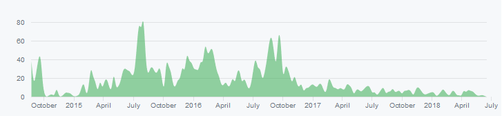
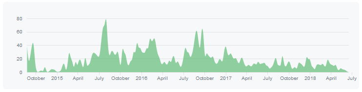
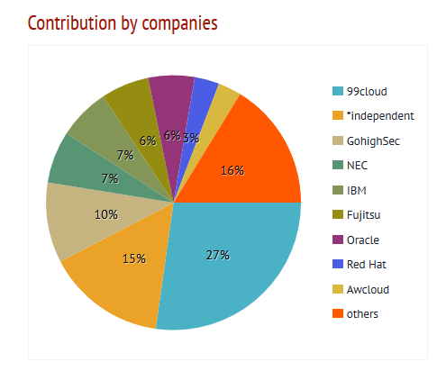
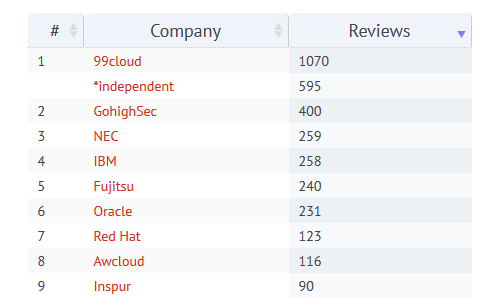
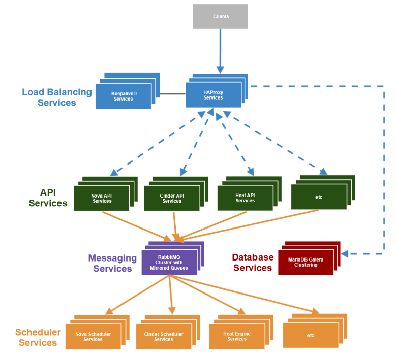
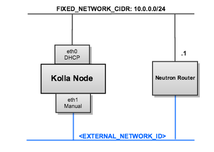
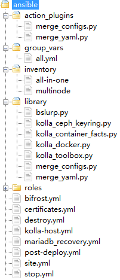
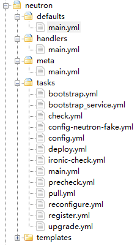

#### 1.Kolla简介

kolla是openstack下面用于自动化部署的一个项目，它基于docker和ansible来实现。Kolla 的最终目标是为OpenStack的每一个服务都创建一个对应的Docker镜像，通过Docker镜像将升级的粒度减小到服务级别，从而在升级时对OpenStack的影响降到最小，并且一旦升级失败，也很容易回滚。升级只需要三步：拉取新版本的容器镜像，停止老版本的容器服务，启动新版本的容器。回滚也不需要重新安装包，直接启动老版本的容器服务就行，非常方便。

Kolla真正意义上`第一个生产部署的版本Ocata版本`发布以后 ，越来越多用户在尝试和测试。

Kolla的优势和使用场景体现在如下几个方面：

- 原子性升级或者回退OpenStack部署。	
  - 基于组件升级OpenStack。
  - 基于组件回退OpenStack。

Kolla就是OpenStack社区的一个用于docker build容器化OpenStack服务的项目，最后，使用其他的社区项目，即kolla-ansible执行部署任务。

Kolla实际上是分为两大块的，一部分，Kolla提供了生产环境级别的镜像，涵盖了Openstack用到的各个服务，另一部分是自动化的部署，也就是上面说的ansible部分。最开始两个部分是在一个项目中的（也就是Kolla），从O版本开始将两个部分独立开来，[Kolla](https://github.com/openstack/kolla)项目用来构建所有服务的镜像，[Kolla-ansible](https://github.com/openstack/kolla-ansible)用来执行自动化部署。

Kolla为OpenStack的部署提供了有效、快捷、方便、易于维护、方便版本更新与回退的方案。kolla-kubernetes和kolla-mesos已经不再维护。

------

#### 2. kolla项目状况

Kolla`基本集成了所有`OpenStack项目，那么那些项目是经过测试成熟可用项目呢。

##### 2.2 基本完善

1. Nova （kvm）
2. Neutron（L3HA）
3. Cinder（Ceph）
4. Glance（Ceph）
5. Keystone （AD）
6. Horizon
7. Heat
8. swift

上面这8个项目，应该算是经过了大量验证，已经达到完美的情况，应该来说，100个节点内，应该是轻松面对。

1. Octavia，负载均衡项目，其实该项目也是可以生产使用，目前就是Horizon UI上有点逻辑问题，导致删除的功能不能正常，需要命令行下删除。他的架构，也是可以支撑大规模部署。VM As Service
2. IRonic，裸机管理，这个功能其实目前是非常好用。包括多租户，都是支持。
3. Sahara，大数据服务，功能都是正常的。
4. Rally，部署完OpenStack，进行压力测试，这块我费了很多心思，也是可以很好支持。完全是可以玩起来。

##### 2.2 可用项目

1. Barbican：密钥管理项目，很多项目的安全，cinder，sahara的数据加密，都是需要这个组件来完成。
2. Designate：dns项目，由于OpenStack平台如果希望支持k8s，需要使用外部dns服务，受到大家重视，该项目也是可以好好测试，目前kolla里也是比较重视。
3. Manila: Netapp和EMC一直都在支持，目前对Ceph集成，也在完善。值得去看看。也是因为K8s，再次受到重视。
4. Mistral：工作流项目，目前例如tacker，都用它来做流程。kolla也是work。
5. Magnum：部署k8s工具，这个工具，目前是可用，经过测试。
6. kuryr：k8s网络相关，
7. zun，容器管理项目，替代nova docker。
8. Dragonflow: 

------

#### 3.kolla的利弊

##### 3.1 kolla的优势

陈沙克：容器化OpenStack好处http://www.chenshake.com/openstack-benefits-of-container/列举了10个优点，以下是一些摘录：

1. 升级：企业使用OpenStack，最大的一个顾虑，就是升级。尤其在OpenStack1年两个版本下，不断的有新的功能的需求的情况下，如果不能升级，其实是很痛苦。尤其在企业的迅速发展的过程中。容器化的OpenStack，升级有多么简单呢？其实就是删掉容器，换上新的容器，用户基本是无感知的状态下完成。
2. 灵活：容易实现控制节点的扩容或者是将某个服务单独部署
3. 解决操作系统厂商依赖：容器里，可以使用rpm包，Deb包，也是可以跑源码安装，这样其实对于操作系统厂商来说，基本就没任何的依赖。不受制操作系统厂商。
4. 部署时间：在生产环境中，部署时间1个小时，和一天，其实区别不大，毕竟部署是一次性的工作。对于测试来说，就完全不一样。如果我10分钟可以完成一次部署，可以测试验证的东西，和几个小时才能完成一次的部署，差异还是很大的。
5. 软件依赖
6. 配置管理
7. 显得简单
8. 计算节点HA
9. 监控与日志分析
10. 创新

目前基本所有提及容器化OpenStack的优势都会提到升级与回滚、快速部署、kolla支持控制节点扩容

##### 3.2 kolla带来的问题与挑战

​	OpenStack容器化部署会引入对于容器如Docker的依赖，所以是否好用还是依赖于Docker的成熟度，同时它也引入了容器编排管理的问题。OpenStack的容器化、微服务化涉及到容器拆分颗粒度、系统间配合等多种考量；容器平台自身的部署，调测等也是难点之一；如何构建好一套本地化的容器平台、如何便捷地部署容器及镜像、如何合理的利用 docker、kubernetes 的相关能力为 OpenStack的容器化部署提供更好的支持，均是需要考虑的内容。

​	除开对Docker以及Kubernetes的依赖之外openstack容器化还有以下问题需要考虑：

- 镜像构建

  由于 OpenStack 部署涉及到的模块相当多，这其中既包括基础服务，如RabbitMQ，MySQL等，也包括 OpenStack  本身的众多服务，如 Keyston，Nova等。同时 Dockerfile 本身的描述能力又很有限。这些服务如何快速构建，是首要解决的问题。

  利用 Jinja2 模板，动态生成 Dockerfile 的文件，有效的简化了 Dockerfile 的内容并增强了 Dockerfile 的描述能力。 利用 Dockerfile 的镜像依赖功能，将公共数据安装到基础镜像中，私有数据安装在最终的镜像中，有效的提升了构建的速度，降低了所有镜像的总大小。现在一共有200多个镜像，总大小不超过4GB。

  同时支持 binary 和 source 两种构建方案，而且支持 CentOS, Ubuntu, OracleLinux 做为基础镜像，可以满足用户不同的需求。

  同时也支持在不修改代码的情况下，对镜像进行定制。

- 容器初始化与适配

  某些容器在启动之前，是要进行一定的初始化操作的，比方说 MySQL 服务，MySQL 的数据文件 /var/lib/mysql  目录肯定要放到一个单独的 docker volume 上面的。然而 docker volume 里面本身是空的，需要通过  mysql_install 命令初始化基础表，同时配置好 root 密码。这类操作只是在第一次启动 MySQL  之前是需要的，之后就没有必要了。所以解决方案是在真正启动 MySQL 之前，创建一个 bootstrap_mysql  的容器来进行初始化，初始化完成后就删除掉。之后在启动真正的 MySQL 容器。多数的有状态的服务都有类似需求，都可以通过这种方案来解决。

- 配置文件管理

  Docker 一直没有把配置文件的管理处理好。它推崇通过环境变量来处理，然而并不是所有的应用都可以适应这种要求。尤其是像 RabbitMQ 这种已经成熟的应用，和 OpenStack 这种有好上千个配置项的项目。如果配置文件固定死，镜像本身就很难做到通用。

  Kolla 的解决方案是：当容器启动的时候，需要通过 volume 的方式把配置文件加载到容器中的特殊位置，Kolla 在所有的镜像里内置一个脚本，通过读取加载进来的 config.json 文件，把配置文件拷贝到真正的目标位置。

  这么做的好处是，配置文件可以依据真正的部署环境，动态的增加或减少。比方说开启 ceph 的时候，就需要把 ceph.conf 的配置文件放到 /etc/ceph/ceph.conf 位置。

- 日志收集

- 配置文件管理

- 容器编排

- 集成测试

- 数据持久化

------

#### **4.社区活跃度**

[Kolla](https://github.com/openstack/kolla)项目用来构建所有服务的镜像，[Kolla-ansible](https://github.com/openstack/kolla-ansible)用来执行自动化部署。

kolla目前有超过7000个commits、291位contributors、741个Star以及387次Fork，项目在2015-2017逐步成熟，在O版本被各公司证实可以投入商用，目前逐步趋于稳定。下图是kolla项目的社区commits整体趋势图。



kolla-ansible目前有超过9000个commits、294位contributors、133个Star以及188次Fork，因为从O版本kolla-ansible才从kolla中独立出来，其commmits趋势图在2017之前和kolla基本保持一致。


------

#### 5.kolla业界情况

从立项开始，Kolla 项目的活跃度就一直保持在前几名，参与公司也是非常多的，包括  Redhat，Oracle，Cisco，Intel，IBM  这些老牌大公司都在里面有贡献。值的一提的是，中国有多家公司在  Kolla 项目中均有大量的贡献，如九州云、海云迅捷、浪潮。 





目前国内外各厂商已经有了一些容器化部署openstack案例

国内现状：

- 九州云：九州云基于Ocata版本的OpenStack发行版，使用Kolla项目实现OpenStack的容器化部署
- 海云捷迅：海云捷迅使用Kolla项目实现OpenStack的容器化部署
- 浪潮：浪潮InCloud OpenStack使用Kolla项目实现OpenStack的容器化部署
- 华三：华三基于Kubernetes实现OpenStack的容器化部署
- EasyStack：使用Helm基于Kubernetes实现OpenStack的容器化部署 (未商用)

国外现状：

- Redhat： Redhat基于Pike版本的OpenStack发行版，基于Kubernetes实现OpenStack的容器化部署
- Mirantis：Mirantis Fuel基于Kubernetes实现OpenStack的容器化部署
- AT & T：使用OpenStack-Helm项目在Kubernetes实现OpenStack的容器化部署 (未商用)
- SK Telecom：使用OpenStack-Helm项目在Kubernetes实现OpenStack的容器化部署 (未商用)

------

#### **6.Kolla架构**

##### 6.1Kolla项目的HA架构

如下图所示。正如其他OpenStack项目一样，对于MySQL的HA方案，默认采用的均是Galera。源码路径：specs/ha.svg



##### 6.2 Kolla节点的网络架

Kolla节点有2张网卡，eth0 IP由DHCP分配，用于内网使用；eth1 IP手动配置，用于外网使用，2个网段均和Neutron Router交互。源码路径：doc/source/reference/kollanet.png



#### 7 kolla-ansible代码结构简要分析

##### 7.1 基本部署流程

kolla-ansible使用ansible工具对容器化openstack进行部署，ansible就不再重复介绍了。kolla-ansible部署的流程见https://docs.openstack.org/kolla-ansible/latest/user/quickstart.html

重要步骤：

- 生成passwords：kolla-genpwd 
- 生成playbook 。kolla-ansible -i <<inventory file>> bootstrap-servers ，其中<<inventory file>> 替换为inventory文件 
- 部署前的检查：kolla-ansible prechecks -i <<inventory file>>
- 部署 OpenStack： kolla-ansible deploy -i <<inventory file>>

##### 7.2 kolla-ansible目录结构

- `ansible` - Contains Ansible playbooks to deploy OpenStack services and infrastructure components in Docker containers.
- `contrib` - Contains demos scenarios for Heat, Magnum and Tacker and a development environment for Vagrant
- `doc` - Contains documentation.
- `etc` - Contains a reference etc directory structure which requires configuration of a small number of configuration variables to achieve a working All-in-One (AIO) deployment.
- `specs` - Contains the Kolla-Ansible communities key arguments about architectural shifts in the code base.
- `tests` - Contains functional testing tools.
- `tools` - Contains tools for interacting with Kolla-Ansible.

setup.cfg

```
[metadata]
name = kolla-ansible
summary = Ansible Deployment of Kolla containers
description-file =
    README.rst
author = OpenStack
author-email = openstack-dev@lists.openstack.org
home-page = https://docs.openstack.org/kolla-ansible/latest/
license = Apache License, Version 2.0
classifier =
    Environment :: OpenStack
    Intended Audience :: Information Technology
    Intended Audience :: System Administrators
    License :: OSI Approved :: Apache Software License
    Operating System :: POSIX :: Linux
    Programming Language :: Python
    Programming Language :: Python :: 2
    Programming Language :: Python :: 2.7
    Programming Language :: Python :: 3
    Programming Language :: Python :: 3.5

[files]
packages =																//包名
    kolla_ansible
data_files =															//pbr指定的数据文件
    share/kolla-ansible/ansible = ansible/*
    share/kolla-ansible/tools = tools/validate-docker-execute.sh
    share/kolla-ansible/tools = tools/cleanup-containers
    share/kolla-ansible/tools = tools/cleanup-host
    share/kolla-ansible/tools = tools/cleanup-images
    share/kolla-ansible/tools = tools/stop-containers
    share/kolla-ansible/tools = tools/ovs-dpdkctl.sh
    share/kolla-ansible/doc = doc/*
    share/kolla-ansible/etc_examples = etc/*
    share/kolla-ansible = tools/init-runonce
    share/kolla-ansible = tools/init-vpn
    share/kolla-ansible = tools/openrc-example
    share/kolla-ansible = setup.cfg

scripts =    //该脚本通过ansible与koll进行交互。命令为：ansible-playbook -i $INVENTORY $EXTRA_OPT		tools/kolla-ansible

[entry_points]
console_scripts =
    kolla-genpwd = kolla_ansible.cmd.genpwd:main
    kolla-mergepwd = kolla_ansible.cmd.mergepwd:main

[global]
setup-hooks =
    pbr.hooks.setup_hook

[build_releasenotes]
all_files = 1
build-dir = releasenotes/build
source-dir = releasenotes/source
```

kolla-ansible的部署脚本主要在ansible目录下。其目录结构如下图：



- action_plugin中在merge_configs.py作用是导入template模板，并且run
- group_vars类似于ansible playbook的vars_files，用来配置参数信息
- 在inventory文件夹中有all-in-one和multinode两个配置文件，这两个文件中的信息可以更改，从而部署符合需求的OpenStack环境
- 在library文件夹下的bslurp.py的作用是从其他node中gfetch文件然后再push到其他的node中;在library文件夹下的kolla_docker.py的作用则是为了kolla控制Docker,其中包含了很多`check`方法，有check文件、镜像、容器、容器的比对,还有compare优先级、镜像，pid，运行环境等以及`pull_image`方法、`remove_container`方法、`create_container`、`start_container`等对容器一系列操作的方法 .
- 最后的role文件夹比较庞大，没有展开，里面是各种组件的yml的配置文件，如ceph,cinder,glance，nova,neutron等。就neutron配置文件做一下分析。其他是类似的。

##### 7.3 kolla-ansible/ansible/roles/neutron分析



- 在templates文件夹下是jinjia2的模板文件

- defaults的main.yml,主要功能是提供了neutron下各个组件(容器化)的配置信息，和这些组件在docker仓库的存放。另外还有调用的路径以及tag的配置信息 

- meta的main.yml,包含dependencies指令指定依赖 

- handlers是a在task之后执行的动作，这里的main.yaml中是一些neutron组件重启动作

- task目录：在task目录下面就是如何根据配置文件启动docker image  ；

  ##### 各个yaml文件功能简要说明：

  1. 默认ansible的所有task是在我们的配置的管理机器上面运行的,当在一个独立的群集里面配置,那是适用的。而有一些情况是,某些任务运行的状态是需要传递给其他机器的,在同一个任务你需要在其他机器上执行,这时候你就要用task委托。在`bootstrap.yml`中提供了Neutron数据库的creating和用户的创建，并赋予权限的配置信息 几乎所有的模块都是会outputs一些东西,甚至debug模块也会。结果变量还有其他的用途,譬如需要保存结果变量,然后在我的playbook的其他地方给使用。`register.yaml`就提供保存结果，完成组件在keystone上的注册操作
  2. `bootstrap_service.yml`中包含了启动一个neutron服务所需要的依赖配置，其中有使用delegate_to关键字便可以配置任务在其他机器上执行。其他模块还是在所有配置的管理机器上运行的,当到了这个关键字的任务就是使用委托的机器上运行。而facts还是适用于当前的host。 
  3. `check.yml`在neutron这里是空的。
  4.  在`config-neutron-fake.yml`中提供了代码的鲁棒性。为了保证config的文件都是存在的，如neutron的neutron.conf和ml2_conf.ini等。在`config.yml`中则是将每个小的agent，server作为item进行划分，再分别把配置信息写入neutron的各个配置文件中。也就是kolla项目所说的原子级别的OpenStack环境部署
  5.  在`deploy.yml`中将boot一个组件所需要的配置信息都include进来，包括有 `ironic-check.yml `、`register.yml`、`config.yml `、`config-neutron-fake.yml `、`bootstrap.yml `以及最后的flush_handlers.
  6. `ironic-check.yml`是检查ironic服务必须启动，neutron的plugin必须使用OpenvSwitch   main.yml提供了一个action.yml的配置文件入口
  7. `main.yml`task入口根据kolla_action执行对应task
  8. `precheck.yml`检查依赖资源情况
  9. `pull.yml`中提供了docker的pull方法的配置信息，使用了”pull_image”的方法，docker_common_options下的参数，以及pull使用的image。
  10. `reconfigure.yml`重新deploy
  11. upgrade.yml则是完成容器的升级，include config.yml bootstarp_service.yml

#### 参考：

https://blog.csdn.net/Allison_ywt/article/details/78518096

https://blog.csdn.net/JackLiu16/article/details/79942827

https://github.com/openstack/kolla-ansible